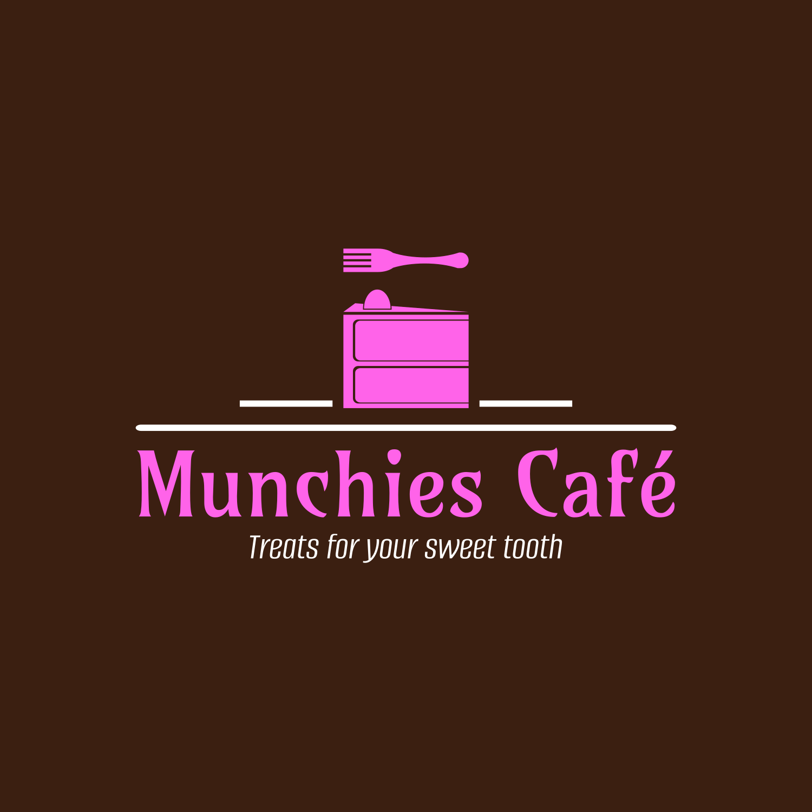
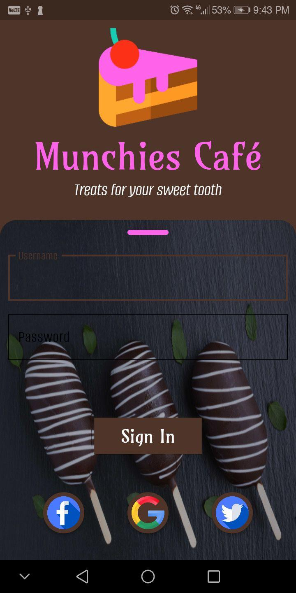
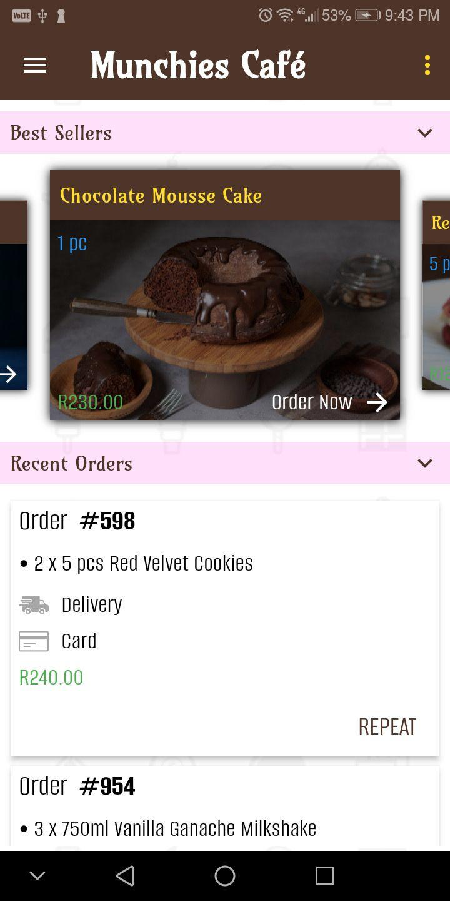
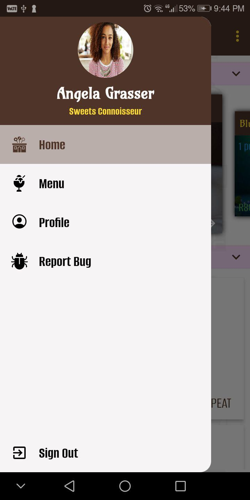
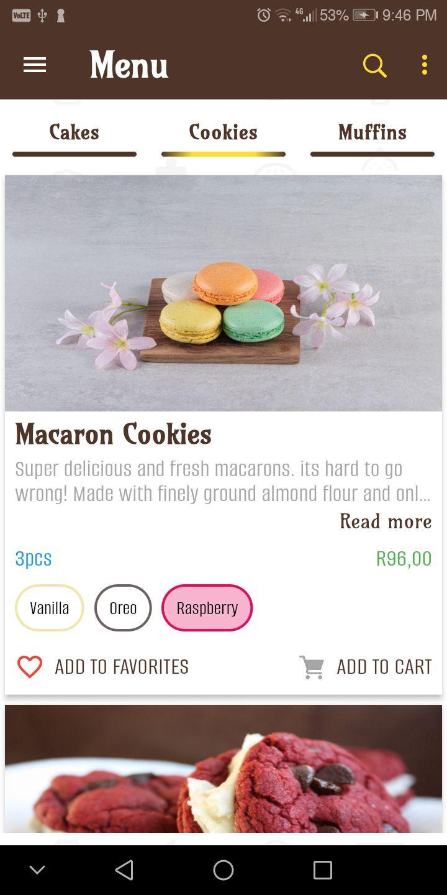
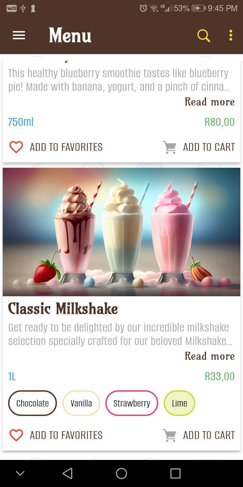
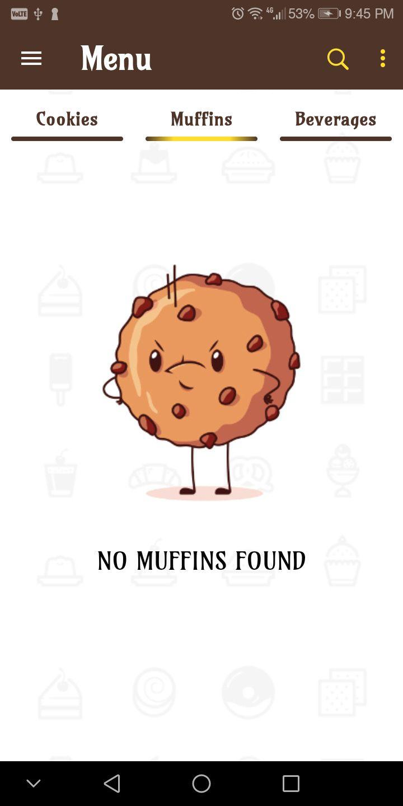
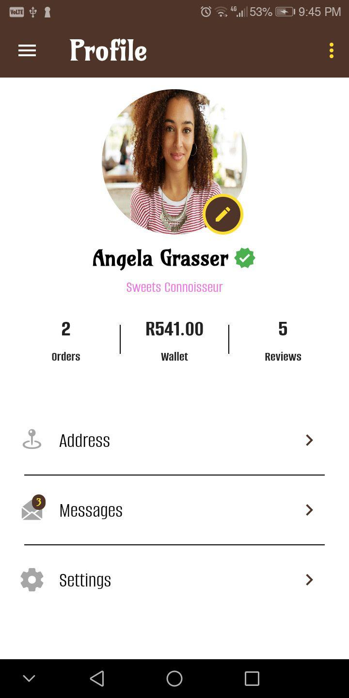

<p align="center">
  
</p>

<h1 align="center">Munchies Café</h1>

<p align="center">
  <em>Treats for your sweet tooth</em> — a Flutter mobile app for a fictional dessert café.
</p>

<p align="center">
  
  
  
  
</p>

---

## About

Munchies Café is the customer app for an imaginary bakery-café: browse the menu, see best sellers and past orders, pick flavours and manage a cart. I built it while learning Dart and Flutter, and it now serves as a portfolio piece that shows how I structure a Flutter app, build custom UI and handle navigation and app-wide state.

The app is a **front-end showcase**. It runs on sample data with no backend, so sign-in accepts any details and orders aren't placed. See [Status and roadmap](#status-and-roadmap) for what's next.

## Screenshots

<table>
  <tr>
    <td align="center"><br><sub>Sign in</sub></td>
    <td align="center"><br><sub>Home</sub></td>
    <td align="center"><br><sub>Navigation drawer</sub></td>
  </tr>
  <tr>
    <td align="center"><br><sub>Menu with flavour options</sub></td>
    <td align="center"><br><sub>Menu categories</sub></td>
    <td align="center"><br><sub>Empty category</sub></td>
  </tr>
  <tr>
    <td align="center"><br><sub>Profile</sub></td>
    <td></td>
    <td></td>
  </tr>
</table>

## Features

- **Sign-in screen** with the café branding (the social sign-in buttons are visual only).
- **Home dashboard**: an auto-playing best-sellers carousel, recent orders with delivery or collection and payment method, and wallet transactions.
- **Menu**: category tabs (cakes, cookies, muffins, beverages), product cards with expandable "read more" descriptions, flavour chips and add-to-cart / add-to-favourites actions.
- **Cart**: line items with quantities, a running total and a scroll-to-top button.
- **Profile**: order, wallet and review stats plus account shortcuts.
- **In-app notifications**: banners that slide in at the top of the screen, backed by a message service that also saves them.

## Under the hood

- **Feature-first structure.** Each feature lives in its own folder (`authentication-component`, `home-component`, `menu-component`, `cart-component`, `user-component`, `message-component`) with its page, widgets and models. Shared code sits in `common/`.
- **Custom navigation.** Named routes are generated in one place (`PageRouteHelper`), pages slide in from a chosen direction through a custom `PageRoute`, routes can be restored after the app is killed, and a route observer logs every navigation.
- **App-wide state with Provider.** `MessageService` is a `ChangeNotifier` that streams notifications to the UI and saves messages with `shared_preferences`.
- **One theme, one palette.** All colours come from `AppColors` and the Material 3 theme from `AppTheme`, with custom fonts (Amarante for headings, Alumni Sans for body text).
- **Branded launch.** App icons and the native splash screen are generated with `flutter_launcher_icons` and `flutter_native_splash`.
- **Modern Dart.** Enum extensions use Dart 3 switch expressions, and the code follows the recommended `flutter_lints` rules.

## Tech stack

| | |
|---|---|
| Framework | Flutter 3.44 (stable), Dart 3 |
| State management | [provider](https://pub.dev/packages/provider) |
| Storage | [shared_preferences](https://pub.dev/packages/shared_preferences), [path_provider](https://pub.dev/packages/path_provider) |
| UI | [carousel_slider](https://pub.dev/packages/carousel_slider), [intl](https://pub.dev/packages/intl) for currency formatting |
| Tooling | flutter_lints, flutter_launcher_icons, flutter_native_splash |
| Android build | Gradle 9.1, Android Gradle Plugin 9.0, Kotlin 2.3, Java 17+ |

## Getting started

### Prerequisites

- [Flutter](https://docs.flutter.dev/get-started/install) 3.44 or newer
- JDK 17 or newer (tested with JDK 21)
- Android Studio or the Android SDK, plus an emulator or an Android phone

### Run it

Clone the repository, then:

```bash
cd munchies_cafe
flutter pub get
flutter run
```

### Build a release APK

```bash
flutter build apk --release --split-per-abi
```

The APKs land in `munchies_cafe/build/app/outputs/flutter-apk/`. Most modern phones need `app-arm64-v8a-release.apk`.

### Run the tests

```bash
flutter test
```

## Project structure

```
Munchies-Cafe/
├── Design/                 Logo (PNG, SVG, PDF) and font source files
├── docs/screenshots/       Screenshots used in this README
└── munchies_cafe/          The Flutter app
    ├── assets/images/      Product photos, icons and backgrounds
    ├── fonts/              Bundled fonts and their licences
    ├── lib/
    │   ├── main.dart
    │   ├── authentication-component/
    │   ├── home-component/
    │   ├── menu-component/
    │   ├── cart-component/
    │   ├── user-component/
    │   ├── message-component/
    │   └── common/         Navigation, theme, services, logging, shared widgets
    └── test/
```

## Status and roadmap

This is a UI prototype with sample data. Planned next steps:

- [ ] Shared cart state, so "Add to cart" fills the cart and the total and checkout work
- [ ] Menu search
- [ ] A Messages page in the navigation drawer, showing saved notifications
- [ ] Favourites
- [ ] Form validation on sign-in
- [ ] A backend for the menu, orders and user accounts

## Credits

- **Fonts:** [Amarante](https://fonts.google.com/specimen/Amarante) by Sorkin Type Co and [Alumni Sans](https://fonts.google.com/specimen/Alumni+Sans) by The Alumni Sans Project Authors, both under the SIL Open Font License 1.1 ([Amarante](munchies_cafe/fonts/OFL-Amarante.txt), [Alumni Sans](munchies_cafe/fonts/OFL-AlumniSans.txt)).
- **Photos and icons:** product photos, the sample profile photo and the icons come from free stock photo and icon sites. They belong to their creators and are included for demonstration only.

## Licence

The source code is released under the [MIT Licence](LICENSE). The fonts keep their own licences (SIL OFL 1.1), and the third-party photos and icons are **not** covered by the MIT Licence.

## Author

**Siyabonga Mndaweni**
